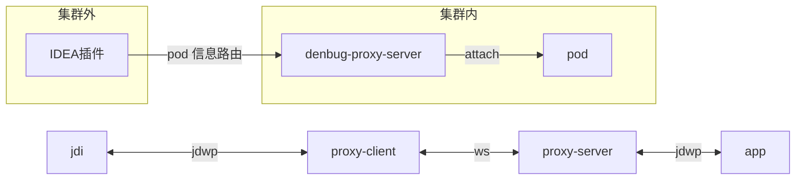
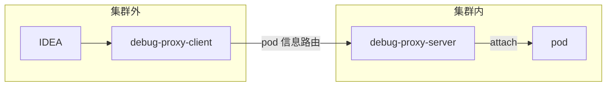

背景: 将debug-proxy-client集成入 idea 的能力中,减少一层代理,让 idea 的远程调试连接支持添加自定义参数键值对
架构变更成这样:



要求: 使用 java 写一个 idea 插件支持代理后进行远程调试: https://juejin.cn/post/7390340749579370548
1. 添加新的`Run/Debug Configurations`类型然后实现 ws 代理 debug. idea 原生的 `Remote JVM Debug` 功能:intellij-community
2. 编译: ./gradlew buildPlugin 
3. idea 相关文档:
- https://plugins.jetbrains.com/docs/intellij/execution.html
- https://plugins.jetbrains.com/docs/intellij/run-configurations.html
- https://plugins.jetbrains.com/docs/intellij/run-configurations-tutorial.html
---

调试启动--> 启动client--ws-->连接proxy-server--根据pod信息路由-->pod和proxy-server建立通道 --> 启动idea远程调试-->连接client-->ws开始调试

---

## 背景
idea 支持远程调试 k8s 集群内的pod.
## 设计
idea的远程调试连接本地的 debug-proxy-client 本地应用,然后 debug-proxy-client 通过透明代理 idea 的连接请求并添加自定义参数连接到debug-proxy-server,最后 debug-proxy-server解析参数并透明代理连接到对应 pod,使得 idea可以进行调试

## 需求
1. 用 java 和 maven 编写 debug-proxy-client 和 debug-proxy-server.
2. debug-proxy-client 支持在原有的连接请求上自定义参数连接,如:
```java
   Map<String, Connector.Argument> arguments = connector.defaultArguments();
   arguments.get("xxx").setValue("xxx");
```
debug-proxy-server支持参数解析后路由到对应 pod 进行调试连接.

3. 写一个 demo 应用和简单的 jdi 调试器模拟 idea,验证  调试器通过 debug-proxy-client 连接 debug-proxy-server 进行远程demo应用.

